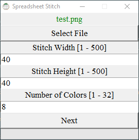
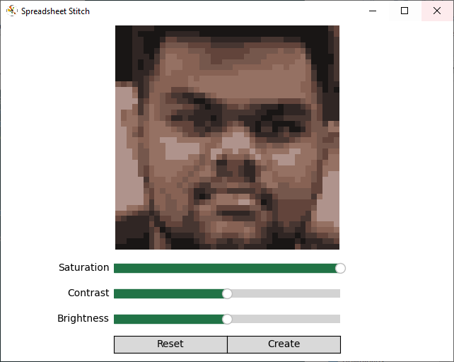
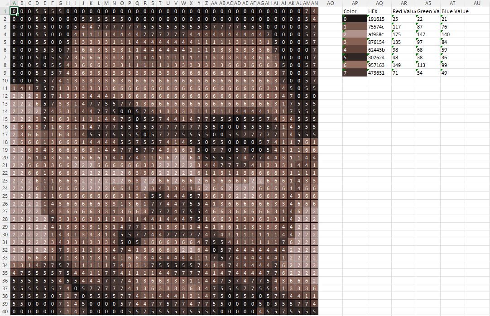

# Spreadsheet Stitch - v1.0

 **Spreadsheet Stitch** is an application to convert images to accessible cross stich patterns. Simple launch the application, select your image file, choose your pattern height, width, number of colors, make some minor color adjustments (if you want), and your pattern will be created in a flash!

Select a File | Tweak Colors | Final Output
:-:|:-:|:-:
  |   |  


 ## How To Use

No installation required. You can move the *SpreadsheetStitch* folder wherever you would like, but keep its organization intact to ensure the application runs correctly. To use:

1. Run *SpreadsheetStitch.exe*.
2. Select the image you wish to use.
3. Input the pattern options.
4. Click the *Next* button. The loading bar under the *Next* button will fill to show progress.
5. Use the image preview window to make color adjustements (if desired).
6. Click the *Create* button.
7. Your new pattern file has now been created in the *Patterns* folder.

The resulting file will have the same name as the original image file. This file can be opened in applications which support the [Microsoft Excel Open XML (*.xlsx*)](https://www.howtogeek.com/392333/what-is-an-xlsx-file-and-how-do-i-open-one/) file format. The most common application that supports these files is **Microsoft Excel**, but the follow free alternatives should work as well: [**Google Sheets**](https://www.google.com/sheets/about/), [**OpenOffice**](https://www.openoffice.org/download/), and [**LibreOffice**](https://www.libreoffice.org/).

## How To Contribute

Source code available on [GitHub](https://github.com/JohnSermarini/SpreadsheetStitch).

This project was built using *Python 3.10.11*. Use *pip* and the *requirements.txt* to install the necessary packages. The front-end interfaces are built primarly using [*Tkinter*](https://docs.python.org/3/library/tkinter.html) and currently all code operates within the *SpreadsheetStitch.py* file.

```
python SpreadsheetStitch.py 
```

Included in this repo is a Build.bat, which uses PyInstaller to create the new application folder **SpreadsheetStitch** and then quickly cleans up all the mess it makes in the process. Inside this new folder is everything needed to run the application stand-alone, and it should auto-add *ReadMe* and license files as well. 

#### TODO

- "Only use XYZ" colors feature for making do with what you have
- Shrink .exe size
- Build for Linux/Mac
- Add help/info ribbon to toolbar
- Re-sizeable window
- Choose input/output folders
- Full [DMC color support](https://lordlibidan.com/dmc-color-chart/)
- Custom symbols in Excel
- Add image dimensions to GUI
- More comments

## Licenses and Thanks

###### Spreadsheet Stitch is licensed under the [MIT License](LICENSE) License.

Special thanks to [openpyxl](https://openpyxl.readthedocs.io/en/stable/) and [Tkinter](https://docs.python.org/3/library/tkinter.html)


